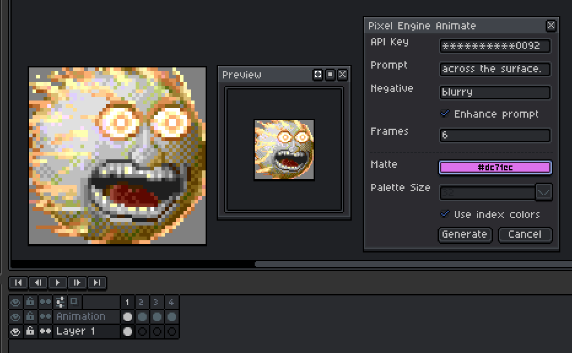

# Pixel Engine Animate

An Aseprite extension that sends the active frame to the [Pixel Engine](https://pixelengine.ai/) Animate API and imports the returned spritesheet as a new animation layer.




## Requirements

- [Aseprite](https://www.aseprite.org/) with extensions enabled
- Windows with `powershell.exe` available
- A [Pixel Engine API key](https://pixelengine.ai/account?tab=api)

## Install

1. Copy this repo into your Aseprite extensions directory, or package it as an Aseprite extension.
2. Restart Aseprite if it is already open.
3. Create a `.env` file next to `package.json` and `pixel-engine-animate.lua`.
4. Add your API key:

```env
ASEPRITE_KEY=pe_sk_your_key_here
```

You can also paste the API key into the dialog. The extension remembers the last values you used in Aseprite's local preferences.


## Prompt Enhancement

Prompt enhancement uses Pixel Engine's `/enhance-prompt` endpoint by default.
You can also use a custom prompt enhancement flow by adding:

```env
USE_CUSTOM_ENHANCE=true
```

If you enabled, you will also need to add your OpenAI API key:

```env
OPENAI_API_KEY=sk-your-key-here
OPENAI_MODEL=gpt-5-mini-2025-08-07
```

> **Note** 
> You can modify the custom rewrite prompt in `lib/openai/prompt_enhance.lua`.

## Use

1. Open a sprite and select the frame you want to animate.
2. Run `File > Pixel Engine Animate`.
3. Enter a prompt, optional negative prompt, matte color, and the number of output frames.
4. Optional: enable `Enhance prompt` to send your prompt plus the active frame to Pixel Engine's prompt enhancement endpoint before the animate request.
5. Choose either:
   - `Use index colors` to send the sprite palette directly
   - `Palette Size` to let Pixel Engine generate a palette
6. Click `Generate`.

> **Note** 
> You will be asked to allow the extension to run PowerShell scripts on the first run.

The extension exports the active frame to a temporary PNG, waits for Pixel Engine to finish, downloads the spritesheet, and imports each frame into a new layer named `Animation`.

## Notes

- Pixel Engine currently accepts images up to `256x256`.
- The aspect ratio must stay between `1:2` and `2:1`.
- Frame count must be an even number between `2` and `16`.
- Matte color defaults to `#EE00FF`, but you can change it from the color picker in the dialog.
- Temporary files are cleaned up automatically after each run.

## Repo layout

- `pixel-engine-animate.lua`: extension entrypoint
- `lib/pixel_engine/`: Lua modules for config, sprite handling, and command flow
- `lib/openai/`: Lua modules for prompt enhancement config and helper
- `lib/utils/`: Lua modules for shared helpers
- `scripts/pixel-engine-http.ps1`: PowerShell helper that calls the Pixel Engine API
- `scripts/pixel-engine-enhance-prompt.ps1`: PowerShell helper that calls Pixel Engine's `/enhance-prompt` endpoint
- `scripts/openai-prompt-enhance.ps1`: PowerShell helper for the optional OpenAI prompt enhancement flow
